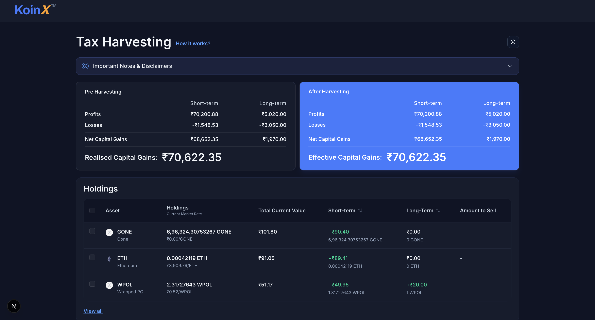
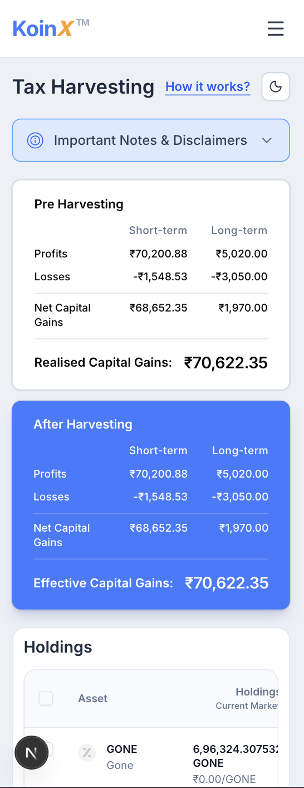

# KoinX - Tax Harvesting Dashboard

A precision-crafted, highly interactive React dashboard built to calculate, simulate, and optimize crypto tax harvesting. Designed pixel-perfectly with Next.js and Tailwind CSS.

**[🌐 View Live Deployment](https://asyn-x.vercel.app)** 

## 📸 Screenshots

*(Replace with actual screenshot paths if available)*
- **Desktop Dark Mode:**
  

- **Mobile Responsive View:**
  

## ✨ Key Features & Bonus Implementations

- **Dynamic Tax Harvesting Simulation**  
  Real-time computation engine that updates `Pre-Harvesting` and `After-Harvesting` realized and net capital gains immediately when specific holdings are toggled.

- **Clean, Reusable Components & Proper State Management**
  Aggregated React state (`useState`, `useMemo`) powers shared components like `HarvestSummaryCard`, `HoldingsTable`, and layout blocks, ensuring a highly DRY and maintainable architecture.

- **Loader/Error States for API Calls**
  A dedicated asynchronous data-fetching block (`getHoldings`, `getCapitalGains`) simulates network delay with polished loading skeletons and handles edge-case error states safely.

- **Visual Feedback for Selections**
  Selected table rows receive distinct background highlighting (e.g., deep blue in dark mode) accompanied by dynamic, automatically recalculating totals so the user receives instant, native-feeling feedback.

- **"View All" Functionality**  
  The holdings table automatically caps at the top 4 assets to reduce cognitive load and keep the UI uncluttered, featuring a smooth, toggleable `View all / Show less` expander.

- **Intelligent Tri-state Sorting**  
  Clickable table headers offering immediate Ascending, Descending, and Default restorable sorting on both *Short-term* and *Long-term* columns, complete with indicator arrows.

- **Pixel-Perfect Dark Mode Integration**  
  First-class native dark mode using `next-themes`. Colors are precisely mapped to standard hex tokens (`#0F1425`, `#161C2D`, `#2C3B6E`, `#1A254B`) to perfectly match the sleek production mockups.

- **Fully Responsive Architecture**   
  Fluidly adapts from ultra-wide desktop monitors down to mobile devices. It gracefully converts metric cards to vertical stacks, features a mobile menu icon, and ensures horizontal scrolling for the main ledger.

## 📝 Assumptions

1. **Mock Data Layer**: Since no real backend was provided, realistic network calls are simulated using `Promise` delays over local mock data (`data/mockData.ts`).
2. **State Management**: Next.js App Router and React Hooks (`useState`, `useMemo`, `useEffect`) were used instead of Redux or Context API. Given the localized scope of the tax harvesting calculator, bringing in a full global state context/Redux store would over-engineer the component tree. Hook-based lifted state is robust, highly performant, and correctly scoped here.
3. **Scientific Notation & Formatting**: Very small coin prices (like `e-7`) are intercepted and formatted precisely with a custom `compactCurrency` utility rather than rounding straight to zero to preserve accuracy.

## 🛠 Tech Stack

- **Framework:** [Next.js](https://nextjs.org/) (App Router, Client Components)
- **Language:** TypeScript
- **Styling:** Tailwind CSS
- **Components:** [shadcn/ui](https://ui.shadcn.com/) primitives (Headless, accessible UI)
- **Icons:** Lucide React
- **Theming:** `next-themes` (Class-based strategy)

## 🚀 Quick Start

1. **Install dependencies:**
   ```bash
   pnpm install
   ```

2. **Run the development server:**
   ```bash
   pnpm dev
   ```

3. **Open [http://localhost:3000](http://localhost:3000)** in your browser to see the automatically redirecting Entry/Home page leading directly into the main Tax Harvesting board (`/koinX`).
